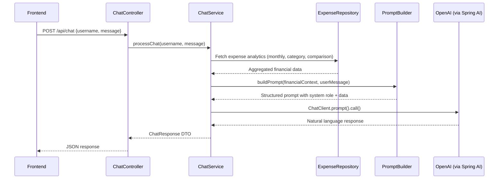

# AI-Powered Financial Chatbot for Expense Tracker

## Background

Add a production-ready, context-aware AI chatbot to the existing Spring Boot 4.0 Expense Tracker application. The chatbot will use **Spring AI 2.0** with **OpenAI GPT** to answer user queries based on their personal expense data from Aiven MySQL.

The existing app has: `Expense` (id, title, amount, category, date, username), `MonthlyIncome`, `PlannedExpense`, `User` entities with full CRUD, auth (register/login), and Spring Security (currently all-permitAll).

---

## Architecture



**Key design decisions:**
- Use **Spring AI `ChatClient`** (not raw HTTP to OpenAI) for type-safe, Spring-idiomatic integration
- Dedicated `ExpenseAnalyticsRepository` interface with `@Query` JPQL for optimized aggregation queries
- `PromptBuilder` utility class to centralize prompt engineering — keeps prompts maintainable and testable
- In-memory chat history (per-user, last 10 messages) for conversational context
- `RestClientConfig` with caffeine-like timeout settings for resilient AI calls

---

## User Review Required

> [!IMPORTANT]
> **OpenAI API Key Required**: You will need to provide your OpenAI API key. It will be configured via `application.properties` as `spring.ai.openai.api-key`. You can also set it as an environment variable `OPENAI_API_KEY`.

> [!WARNING]
> **Spring Boot 4.0 + Spring AI 2.0**: Your project uses Spring Boot 4.0.1. Spring AI 2.0.0-M5 is the compatible milestone. Since it's a milestone release, we need to add the Spring Milestones repository to `pom.xml`.

> [!IMPORTANT]
> **Cost Consideration**: Each chatbot query makes a call to OpenAI's API. The default model will be `gpt-4o-mini` (cost-effective). You can switch to `gpt-4o` in config for higher quality responses.

---

## Open Questions

> [!IMPORTANT]
> **Q1**: Do you have an OpenAI API key ready, or would you prefer to use a different LLM provider (e.g., Google Gemini, Anthropic Claude)? The implementation uses Spring AI which supports all of these with minimal code changes.

> [!IMPORTANT]
> **Q2**: Should the chatbot endpoint require authentication (i.e., only logged-in users can chat), or keep it open like your current endpoints? The plan currently keeps it open (consistent with your existing `permitAll()` security config) but passes `username` in the request body.

---

## Proposed Changes

### Dependencies & Configuration

#### [MODIFY] [pom.xml](file:///d:/javaprog/ExpenseTracker/pom.xml)

Add Spring AI OpenAI starter dependency and the Spring Milestones repository:

```xml
<!-- New dependency -->
<dependency>
    <groupId>org.springframework.ai</groupId>
    <artifactId>spring-ai-starter-model-openai</artifactId>
    <version>2.0.0-M5</version>
</dependency>

<!-- New repository (for milestone builds) -->
<repositories>
    <repository>
        <id>spring-milestones</id>
        <name>Spring Milestones</name>
        <url>https://repo.spring.io/milestone</url>
        <snapshots><enabled>false</enabled></snapshots>
    </repository>
</repositories>
```

#### [MODIFY] [application.properties](file:///d:/javaprog/ExpenseTracker/src/main/resources/application.properties)

Add OpenAI configuration:

```properties
# AI Chatbot Configuration
spring.ai.openai.api-key=${OPENAI_API_KEY:your-api-key-here}
spring.ai.openai.chat.options.model=gpt-4o-mini
spring.ai.openai.chat.options.temperature=0.3
```

Low temperature (0.3) ensures factual, data-grounded responses rather than creative hallucinations.

---

### Repository Layer — Analytics Queries

#### [NEW] [ChatExpenseRepository.java](file:///d:/javaprog/ExpenseTracker/src/main/java/com/pragya/expensetracker/repository/ChatExpenseRepository.java)

A dedicated repository interface with optimized JPQL aggregation queries. Separate from the existing `ExpenseRepository` to keep concerns clean.

**Queries provided:**
| Method | Purpose |
|--------|---------|
| `findByUsernameAndDateBetween()` | Get all expenses for a date range |
| `getTotalSpendingByMonth()` | SUM of amounts for a specific month |
| `getCategoryWiseSpending()` | GROUP BY category with SUM, for a month |
| `getTopExpenses()` | Top N expenses by amount for a month |
| `getMonthlyTotals()` | Spending totals for last N months (trend) |
| `getDailySpendingForMonth()` | Day-by-day breakdown for a month |

All queries are scoped by `username` to ensure data isolation.

---

### DTO Layer — Chat Request/Response

#### [NEW] [ChatRequest.java](file:///d:/javaprog/ExpenseTracker/src/main/java/com/pragya/expensetracker/dto/ChatRequest.java)

```java
{
    "username": "pragya",
    "message": "How much did I spend this month?"
}
```

Fields: `username` (String, required), `message` (String, required).

#### [NEW] [ChatResponse.java](file:///d:/javaprog/ExpenseTracker/src/main/java/com/pragya/expensetracker/dto/ChatResponse.java)

```java
{
    "reply": "Based on your data, you spent ₹12,450 this month...",
    "timestamp": "2026-05-05T22:15:00",
    "dataSnapshot": {
        "totalSpent": 12450.0,
        "topCategory": "Food",
        "expenseCount": 23
    }
}
```

Fields: `reply` (String), `timestamp` (LocalDateTime), `dataSnapshot` (Map<String, Object> — optional structured data alongside the natural language response).

#### [NEW] [FinancialContext.java](file:///d:/javaprog/ExpenseTracker/src/main/java/com/pragya/expensetracker/dto/FinancialContext.java)

Internal DTO that holds all aggregated financial data for a user. Used to build the prompt — never exposed to the API.

Fields: `currentMonthTotal`, `lastMonthTotal`, `categoryBreakdown` (Map), `topExpenses` (List), `monthlyTrend` (List), `monthlyIncome`, `plannedExpenses` (List).

---

### AI / Prompt Layer

#### [NEW] [PromptBuilder.java](file:///d:/javaprog/ExpenseTracker/src/main/java/com/pragya/expensetracker/ai/PromptBuilder.java)

Centralized prompt engineering. Builds a structured prompt with:

1. **System message** — Defines the AI's role, constraints, and output format
2. **Financial data injection** — Serialized user data as structured text
3. **User query** — The actual question
4. **Chat history** — Last few messages for conversational continuity

**System prompt template:**
```
You are a smart, friendly financial assistant for an expense tracking app.
You help users understand their spending patterns, identify savings opportunities,
and make better financial decisions.

STRICT RULES:
1. ONLY use the financial data provided below. NEVER make up numbers.
2. If data is insufficient to answer, say so honestly.
3. Keep responses concise (under 200 words) unless the user asks for detail.
4. Use currency symbol ₹ for amounts.
5. When comparing periods, show percentage changes.
6. Provide actionable suggestions when relevant.

USER'S FINANCIAL DATA:
========================
Current Month ({month}/{year}):
- Total Spent: ₹{totalSpent}
- Expense Count: {count}
- Category Breakdown:
  {categoryBreakdown}
- Top Expenses:
  {topExpenses}

Previous Month:
- Total Spent: ₹{lastMonthTotal}

Monthly Income: ₹{income}
Savings Rate: {savingsRate}%

Planned Expenses (pending):
  {plannedExpenses}
========================

CONVERSATION HISTORY:
{chatHistory}
```

#### [NEW] [ChatHistoryManager.java](file:///d:/javaprog/ExpenseTracker/src/main/java/com/pragya/expensetracker/ai/ChatHistoryManager.java)

In-memory, per-user chat history using `ConcurrentHashMap<String, List<ChatMessage>>`. Stores last 10 messages (5 user + 5 assistant). Thread-safe. Gets cleared on session timeout or explicit reset.

---

### Service Layer

#### [NEW] [ChatService.java](file:///d:/javaprog/ExpenseTracker/src/main/java/com/pragya/expensetracker/service/ChatService.java)

The core orchestration service. Flow:

1. Validate the request (username exists, message not blank)
2. Fetch financial data from `ChatExpenseRepository` + `MonthlyIncomeRepository` + `PlannedExpenseRepository`
3. Build `FinancialContext` DTO
4. Retrieve chat history for the user
5. Call `PromptBuilder` to construct the full prompt
6. Send to OpenAI via Spring AI `ChatClient`
7. Save messages to chat history
8. Return `ChatResponse` with the AI's reply + data snapshot

**Error handling:**
- If OpenAI call fails → return a graceful error message (not a stack trace)
- If no expense data found → still respond, noting the user has no data yet
- Timeout handling via Spring AI's built-in retry/timeout config

---

### Controller Layer

#### [NEW] [ChatController.java](file:///d:/javaprog/ExpenseTracker/src/main/java/com/pragya/expensetracker/controller/ChatController.java)

```
POST /api/chat          → Process a chat message
POST /api/chat/reset    → Clear chat history for a user
```

- `@CrossOrigin(origins = "*")` to match existing controllers
- Input validation via `@Valid`
- Returns `ResponseEntity<ChatResponse>`

---

### Security Configuration

#### [MODIFY] [SecurityConfig.java](file:///d:/javaprog/ExpenseTracker/src/main/java/com/pragya/expensetracker/config/SecurityConfig.java)

Add `/api/chat/**` to the `permitAll()` list, consistent with existing security posture.

---

### AI Configuration

#### [NEW] [AiConfig.java](file:///d:/javaprog/ExpenseTracker/src/main/java/com/pragya/expensetracker/config/AiConfig.java)

Spring configuration class that creates the `ChatClient` bean from Spring AI's `ChatClient.Builder`. This gives us a single, reusable, configured client instance.

---

## File Summary

| # | Action | File | Purpose |
|---|--------|------|---------|
| 1 | MODIFY | `pom.xml` | Add Spring AI dependency + milestone repo |
| 2 | MODIFY | `application.properties` | Add OpenAI API key + model config |
| 3 | NEW | `repository/ChatExpenseRepository.java` | Aggregation queries for analytics |
| 4 | NEW | `dto/ChatRequest.java` | Chat request DTO |
| 5 | NEW | `dto/ChatResponse.java` | Chat response DTO |
| 6 | NEW | `dto/FinancialContext.java` | Internal financial data DTO |
| 7 | NEW | `ai/PromptBuilder.java` | Prompt engineering & template building |
| 8 | NEW | `ai/ChatHistoryManager.java` | In-memory per-user chat history |
| 9 | NEW | `service/ChatService.java` | Core orchestration service |
| 10 | NEW | `controller/ChatController.java` | REST endpoints for chat |
| 11 | NEW | `config/AiConfig.java` | Spring AI ChatClient bean config |
| 12 | MODIFY | `config/SecurityConfig.java` | Allow `/api/chat/**` |

**Total: 9 new files, 3 modified files**

---

## Verification Plan

### Automated Tests
1. **Build verification**: `mvnw.cmd compile` — ensure all new files compile cleanly with the new dependencies
2. **Application startup**: `mvnw.cmd spring-boot:run` — verify the app starts without bean wiring errors

### Manual Verification (via Postman/curl)
1. **Basic chat test**:
   ```bash
   curl -X POST http://localhost:8081/api/chat \
     -H "Content-Type: application/json" \
     -d '{"username":"pragya","message":"How much did I spend this month?"}'
   ```
   Expected: JSON response with AI-generated financial insight based on actual DB data.

2. **Category analysis**:
   ```bash
   curl -X POST http://localhost:8081/api/chat \
     -H "Content-Type: application/json" \
     -d '{"username":"pragya","message":"Show my highest spending category"}'
   ```

3. **Month comparison**:
   ```bash
   curl -X POST http://localhost:8081/api/chat \
     -H "Content-Type: application/json" \
     -d '{"username":"pragya","message":"Compare this month vs last month"}'
   ```

4. **Chat history reset**:
   ```bash
   curl -X POST http://localhost:8081/api/chat/reset?username=pragya
   ```

5. **Error case — empty username**: Should return 400 with validation error.
6. **Error case — no data user**: Should return a helpful message saying no expenses found.

---

## Future Improvements (Not in scope but recommended)

1. **Persistent chat history** — Store in MySQL instead of in-memory (add a `ChatMessage` entity)
2. **Streaming responses** — Use Spring AI's streaming API for real-time token-by-token responses
3. **Response caching** — Cache financial context for 5 minutes to reduce DB load on rapid queries
4. **Rate limiting** — Add per-user rate limiting to control OpenAI API costs
5. **Frontend chat widget** — Add a chat UI component to `index.html` / `dashboard.js`
